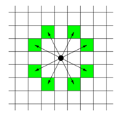

# 🔥 18352 - 특정 거리의 도시 찾기

체스판 위에 한 나이트가 놓여져 있다. 나이트가 한 번에 이동할 수 있는 칸은 아래 그림에 나와있다. 나이트가 이동하려고 하는 칸이 주어진다. 나이트는 몇 번 움직이면 이 칸으로 이동할 수 있을까?



각 테스트 케이스마다 나이트가 최소 몇 번만에 이동할 수 있는지 출력한다.

## ✏️ 코드

```js
const fs = require("fs");
const filePath = process.platform === "linux" ? "/dev/stdin" : "./input.txt";
let input = fs.readFileSync(filePath).toString().trim().split("\n");
const n = +input[0];

function moveKnight(node, l) {
  let nextNodes = [];
  if (node[0] - 1 >= 0 && node[1] + 2 < l) {
    nextNodes.push([node[0] - 1, node[1] + 2, node[2] + 1]);
  }
  if (node[0] - 2 >= 0 && node[1] + 1 < l) {
    nextNodes.push([node[0] - 2, node[1] + 1, node[2] + 1]);
  }
  if (node[0] - 2 >= 0 && node[1] - 1 >= 0) {
    nextNodes.push([node[0] - 2, node[1] - 1, node[2] + 1]);
  }
  if (node[0] - 1 >= 0 && node[1] - 2 >= 0) {
    nextNodes.push([node[0] - 1, node[1] - 2, node[2] + 1]);
  }
  if (node[0] + 2 < l && node[1] + 1 < l) {
    nextNodes.push([node[0] + 2, node[1] + 1, node[2] + 1]);
  }
  if (node[0] + 1 < l && node[1] + 2 < l) {
    nextNodes.push([node[0] + 1, node[1] + 2, node[2] + 1]);
  }
  if (node[0] + 1 < l && node[1] - 2 >= 0) {
    nextNodes.push([node[0] + 1, node[1] - 2, node[2] + 1]);
  }
  if (node[0] + 2 < l && node[1] - 1 >= 0) {
    nextNodes.push([node[0] + 2, node[1] - 1, node[2] + 1]);
  }
  return nextNodes;
}

function bfs(startNode, destination, l, visited) {
  while (startNode.length !== 0) {
    let node = startNode.shift();
    if (!visited[node[0]][node[1]]) {
      visited[node[0]][node[1]] = true;
      if (node[0] === destination[0] && node[1] === destination[1]) {
        return node;
      } else {
        let nextNodes = moveKnight(node, l);
        nextNodes.map((item) => {
          if (!visited[item[0]][item[1]]) {
            startNode.push(item);
          }
        });
      }
    }
  }
}

function solution() {
  for (let i = 0; i < n; i++) {
    let l = +input[3 * i + 1];
    let startNode = [];
    let destination = [];
    let visited = Array.from(Array(l), () => Array(l).fill(false));

    startNode.push([...input[3 * i + 2].split(" ").map(Number), 0]);
    destination = input[3 * i + 3].split(" ").map(Number);

    let node = bfs(startNode, destination, l, visited);
    console.log(node[2]);
  }
}

solution();
```

## 🌱 설명

- BFS 기반 알고리즘
- 방문했는지의 여부를 알기 위해 `visited` 이차원 배열을 만들어 `false` 값으로 초기화.
  - true/false를 쓰지 않고 방문 배열을 그대로 넣으면 시간초과가 남
- 거리를 알기 위해 각 노드 배열의 3번째 값으로 0을 넣고, 이동 시에 1씩 증가시킴
- 8방향으로 움직여야 하기 때문에 `moveKnight` 함수를 만들어 칸 안에 있는 경우만 `nextNodes` 배열에 넣기
  - 반복문을 돌 때 목적지와 같은 경우 바로 `return` 해줌 
  - 이후 `startNode` 와 합칠 때 방문하지 않은 노드만 합치기 위해 if문으로 필터링
  - 이걸 빼먹어도 시간초과가 남
